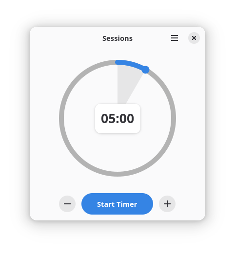
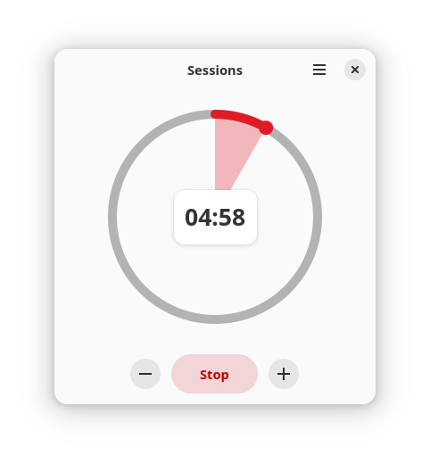

# Sessions

Focus with timed work intervals.

<br/>

[](https://github.com/pojntfx/sessions/actions/workflows/flatpak.yaml)

[](https://pkg.go.dev/github.com/pojntfx/sessions)
[](https://matrix.to/#/#sessions:matrix.org?via=matrix.org)
[](https://hosted.weblate.org/engage/sessions/)

## Overview

Sessions is a simple visual timer application designed specifically for the pomodoro technique, helping you stay productive by breaking work into focused sessions with regular breaks.

It enables you to:

- **Start focused work sessions** with customizable timer durations
- **Track your progress** with a clean, distraction-free interface
- **Take regular breaks** to maintain productivity

## Installation

On Linux, Sessions is available on Flathub:

<a href='https://flathub.org/apps/com.pojtinger.felicitas.Sessions'>

</a>

For other platforms, see [contributing](#contributing); development builds are also available on [GitHub releases](https://github.com/pojntfx/sessions/releases/tag/release-main).

## Tutorial

The [pomodoro technique](https://en.wikipedia.org/wiki/Pomodoro_Technique) is a time management method that uses a timer to break work into intervals, traditionally 25 minutes in length, separated by short breaks. Here's how to use Sessions:

1. **Set your timer**: Choose your work session duration (25 minutes is typical)
2. **Start working**: Focus on a single task during the timer
3. **Take a break**: When the timer ends, take a 5-minute break
4. **Repeat**: After 4 sessions, take a longer 15-30 minute break

🚀 **That's it!** We hope Sessions helps you with your productivity.

## Screenshots

Click on an image to see a larger version.

<a display="inline" href="./assets/meta/screenshot-initial.png?raw=true">

</a>

<a display="inline" href="./assets/meta/screenshot-running.png?raw=true">

</a>

## Acknowledgements

- [Mirabelle Salles](https://github.com/oiimrosabel) contributed the icon.
- [jwijenbergh/puregotk](https://github.com/jwijenbergh/puregotk) provides the GTK4 and `libadwaita` bindings for Go.

## Contributing

To contribute, please use the [GitHub flow](https://guides.github.com/introduction/flow/) and follow our [Code of Conduct](./CODE_OF_CONDUCT.md).

To build and start a development version of Sessions locally, run the following:

```shell
$ git clone https://github.com/pojntfx/sessions.git
$ cd sessions
$ go generate ./...
$ go run .
```

You can also open the project in [GNOME Builder](https://flathub.org/apps/org.gnome.Builder) and run it by clicking the play button in the header bar. Note that GNOME Builder doesn't automatically download the sources specified in [go.mod.json](./go.mod.json), so you need to either run `go mod vendor` manually or copy the contents of [go.mod.json](./go.mod.json) into the `.modules[] | select(.name == "multiplex") | .sources` field of [com.pojtinger.felicitas.Sessions.json](./com.pojtinger.felicitas.Sessions.json).

To translate Sessions, you can use [Weblate](https://hosted.weblate.org/engage/sessions/). This is the current translation status:

[](https://hosted.weblate.org/engage/sessions/)

## License

Sessions (c) 2025 Felicitas Pojtinger and contributors

SPDX-License-Identifier: AGPL-3.0
